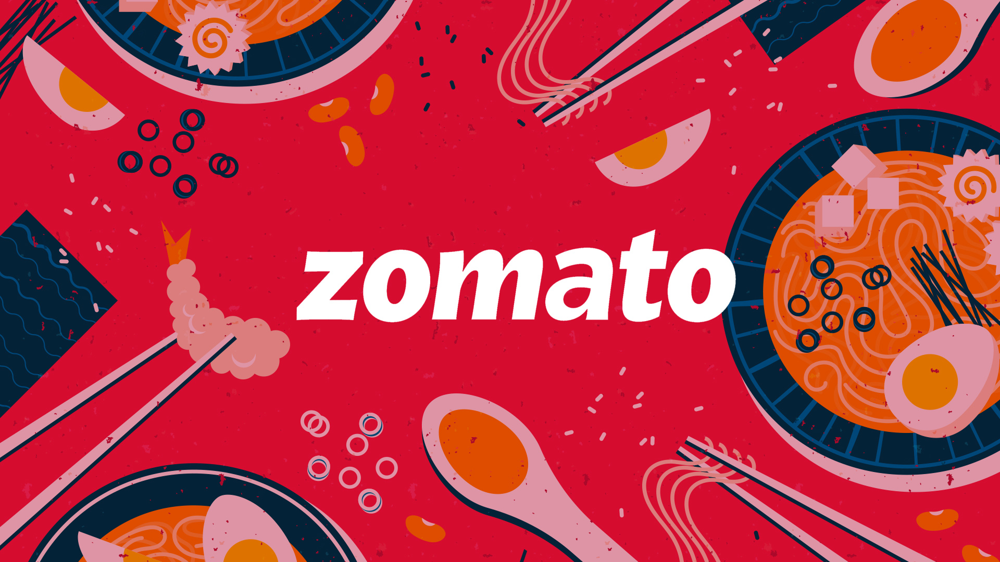

# Zomato Scraper

Zomato Scraper is a web scraping tool developed to gather restaurant data from Zomato using Python, Selenium, and Flask. Originally created for learning purposes, the project aims to provide proficiency in web scraping with Selenium and web development with Flask.

## Tech Stack
- Python
- Selenium
- Flask

## Usage
The main functionality of the project is now accessible through a Flask-based website. Here’s how to use it:

1. **Specify the City**: Select the city for which you want to scrape restaurant data via the web interface.
2. **Adjust Scroll Count**: Set the scroll count on the website to determine how many times the script should scroll to load more restaurants. More scrolls typically fetch more results.
3. **Additional Options**: Configure options such as `more_info`, `images`, `as_csv`, `as_json`, and `as_xlsx` based on your scraping requirements through the web interface.
4. **Run the Scraping**: Initiate the scraping process through the web interface.
5. **Export Data**: Click on the respective button (CSV, JSON, XLSX) to download the scraped data in the desired file format.
   


## Project Structure
- **app.py**: Contains the Flask application and routes for the web interface.
- **main.py**: Contains the core script to initiate the scraping process (used by the Flask app).
- **export/export.py**: Includes the `SCRAPE_ZOMATO_DINEOUT` class for scraping Zomato data.
- **templates/**: Contains HTML templates for the Flask web interface.
- **static/**: Includes static files for the web interface (CSS, JavaScript, etc.).
- **other files**: Additional files or modules used in the project.

## Cloning the Repository

To get started with the Zomato Scraper, follow these steps to clone the repository:

1. Open your terminal or command prompt.
2. Clone the repository using the following command:
   ```bash
   git clone https://github.com/ayushxpatne/zomato-scraper.git
   ```
3. Navigate into the project directory:
   ```bash
   cd zomato-scraper
   ```
4. Install the required dependencies:
   ```bash
   pip install -r requirements.txt
   ```
5. Run the Flask application:
   ```bash
   python app.py
   ```

## Educational and Non-Affiliation Disclaimer
This project is an independent and unofficial educational project. It is not endorsed by or affiliated with Zomato. Any trademarks or service marks displayed in the project are the property of their respective owners.

## Notes
This project serves as an educational tool and is not actively maintained or updated.
